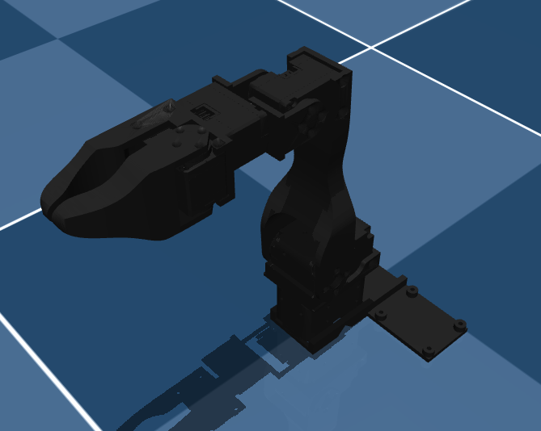
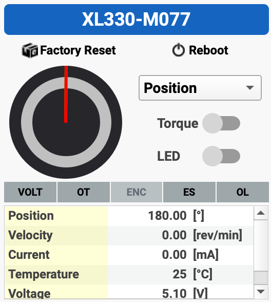

# Robotic Manipulation Course

- [Robotic Manipulation Course](#robotic-manipulation-course)
  - [Dynamixel Robot Arm](#dynamixel-robot-arm)
    - [Required Materials](#required-materials)
    - [Assembly](#assembly)

## Dynamixel Robot Arm

This repository contains the files to build and control a low-cost robot arm that costs about $160. The design is adapted from [low_cost_robot](https://github.com/AlexanderKoch-Koch/low_cost_robot) by [Alexander Koch](https://github.com/AlexanderKoch-Koch).

This robot arm uses Dynamixel XL330 servo motors that weigh only 18g each. This makes the arm very lightweight and fast.
Dynamixel sells the U2D2 adapter to connect the servos to a computer. However, this is very expensive and the latency is very high. This build uses another cheaper adapter board instead.
The robot arm can be controlled with the Dynamixel SDK: ```pip install dynamixel-sdk```

### Required Materials

| Part                          | Cost | Buying link                                    | Specs |
|-------------------------------|------|------------------------------------------------| --- |
| 5x Dynamixel XL330-M288       | $120  | https://www.robotis.us/dynamixel-xl330-m288-t/ | https://emanual.robotis.com/docs/en/dxl/x/xl330-m288/|
| XL330 Idler Wheel             | $10  | https://www.robotis.us/fpx330-h101-4pcs-set/   | |
| XL330 Frame | $7   | https://www.robotis.us/fpx330-s101-4pcs-set/ | |
| Waveshare Serial Bus Servo Driver Board | $10  | https://a.co/d/7C3RUYU                         | |
| 5V Power Supply               | $6   | https://a.co/d/5u90NVp | |
| Table Clamp                   | $6   | https://a.co/d/4KEiYdV                         | |
| Wires                         | $7   | https://a.co/d/hQfk2cb                         | |
| Total                         | $166 |                                                | |

There is usually a 10% discount code for the Robotis shop. It might also help to glue some rubber to the gripper (e.g. https://a.co/d/bEoalHQ). A USB-C cable is necessary to connect the servo driver board to a computer.

### Assembly

Video of the assembly: MAKE VIDEO

1. Print all parts with a 3D printer
   1. The STL files are in `hardware/stl`
   2. The parts are designed to be easy to print; only the moving part of the gripper needs supports
2. Scanning motors
   1. Connect the driver board to a computer (should work with Linux and MacOS)
   2. Figure out the device name (e.g. tty.usbmodem57380045631 for MacOS): ```ls /dev/tty.*```
   3. Scan each motor individually with [Dynamixel Wizard](https://emanual.robotis.com/docs/en/software/dynamixel/dynamixel_wizard2/)
      1. Set the baudrate to 1M for all motors
      2. Set the servo IDs to 1 for the shoulder to 5 for the gripper servo
3. Assembly
   1. Assemble the arm without the base
      1. Make sure that the servos are fixed in the same position as in the CAD
      2. Ensure the default servo angles are all 180 degrees (when the arm is in the position shown in the image below, all servos should be at 180 degrees as shown on the right image from Dynamixel Wizard)
   2. Screw the servo driver board onto the base
   3. Screw the base onto the arm
   4. Connect D, V, and G ports on the driver board to the shoulder rotation servo
   5. Connect successive servos to each other
   6. Connect the driver board to the power supply

<p align="center">
   
   
</p>

**Note**: Ensure the default servo angles are all 180 degrees when the arm is in the position shown in the simulation above. Also note that counterclockwise is negative for rotation in Dynamixel Wizard.
